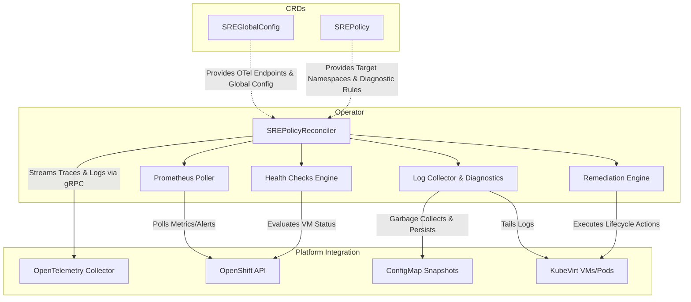

# OpenShift Virtualization SRE Operator

The **OpenShift Virtualization SRE Operator** is a Kubernetes-native controller designed to monitor, diagnose, and remediate OpenShift Virtualization environments. It ensures high availability and smooth operation of virtual machines (VMs) and the underlying OpenShift cluster infrastructure.

This operator utilizes a declarative custom resource, `SREPolicy`, to define checks, alert triggers, log collection settings, and automated remediation actions.

---

## 🚀 Features

- **Automated Health Checks:** Define scheduled checks for VMs, Nodes, Storage, Network, and the OpenShift Cluster itself.
- **Alert-based Triggers:** Seamlessly integrate with Prometheus and Alertmanager to trigger automatic diagnoses or remediations when specific alerts fire.
- **Log Collection & Diagnostics:** Automatically collect and tail logs from target pods (e.g., `virt-launcher` pods) based on error patterns or alert triggers.
- **Automated Remediation:** Built-in actions to respond to failures:
  - `None` (Observability only)
  - `Diagnose` (Trigger log collection and diagnostic aggregation)
  - `Alert` (Forward events/alerts)
  - `Restart`, `Migrate`, `Drain`, `Evict` (Lifecycle operations on VMs/Nodes)
- **OpenTelemetry Tracing:** End-to-end distributed tracing for check executions and remediation actions.

---

## 🏗️ Architecture

The project is structured following standard Kubebuilder conventions but designed with an advanced, decoupled architecture:



- `api/v1alpha1`: Contains the `SREPolicy` and `SREGlobalConfig` CRDs and Go schema types.
- `internal/controller`: Contains the main reconciliation loop (`SREPolicyReconciler`).
- `internal/checks`: Pluggable health checkers for different VM categories.
- `internal/remediation`: Evaluates findings and executes remediation actions.
- `internal/diagnostics`: Collects and aggregates logs and events.
- `internal/prometheus`: Connects to Prometheus to evaluate active metrics.
- `internal/telemetry`: OpenTelemetry native gRPC exporter for distributed tracing and logging.

---

## 📝 Usage

### SREGlobalConfig Custom Resource

The operator requires a single `SREGlobalConfig` to manage cluster-wide settings like observability endpoints, ConfigMap retention, and Prometheus connections.

**Example `SREGlobalConfig`:**

```yaml
apiVersion: sre.kubevirt.io/v1alpha1
kind: SREGlobalConfig
metadata:
  name: sre-global-config
spec:
  observability:
    otelEndpoint: "otel-collector.monitoring.svc:4317"
    tracingEnabled: true
    logsEnabled: true
    metricsEnabled: true
  retention:
    maxConfigMapCopies: 5
    maxConfigMapAgeDays: 7
  prometheus:
    prometheusUrl: "http://prometheus-k8s.monitoring.svc:9090"
    alertManagerUrl: "http://alertmanager-main.monitoring.svc:9093"
    insecureSkipVerify: true
```

### SREPolicy Custom Resource

With the infrastructure settings decoupled, your `SREPolicy` definitions are extremely lightweight and focused purely on diagnostic rules.

**Example `SREPolicy`:**

```yaml
apiVersion: sre.kubevirt.io/v1alpha1
kind: SREPolicy
metadata:
  name: prod-vm-sre-policy
  namespace: openshift-cnv
spec:
  targetNamespaces:
    - production-vms
  
  # Prometheus Alert Triggers
  prometheus:
    enabled: true
    alertTriggers:
      - name: "HighVMCpuUsage"
        alertName: "KubeVirtVMHighCPU"
        enabled: true
        remediation: "Diagnose"
        collectLogs: true

  # Log Collection Strategy
  logCollection:
    enabled: true
    collectVMPodLogs: true
    tailLines: 500
    onAlertOnly: true
    errorPatterns:
      - "OOMKilled"
      - "Connection reset by peer"

  # Active Health Checks
  checks:
    - name: "VMStatusCheck"
      category: "VM"
      enabled: true
      intervalSeconds: 60
      severity: "Warning"
      remediation: "None"
```

---

## 🛠️ Deploying on OpenShift Virtualization from Scratch

We provide a fully standalone Helm chart specifically optimized for OpenShift Virtualization.

### Prerequisites
- Helm v3 installed locally.
- `oc` CLI configured and logged into your OpenShift cluster as `cluster-admin`.
- Podman (or Docker) for building the image.

### 1. Build and Push using OpenShift Image Registry
The operator uses a multi-stage Dockerfile based on Red Hat `ubi-micro`, making it perfectly compliant with OpenShift SCCs and Red Hat security certifications.

We will use the internal OpenShift Image Registry to host the image:

```bash
# Ensure the internal registry is exposed (if running externally)
oc patch configs.imageregistry.operator.openshift.io/cluster --patch '{"spec":{"defaultRoute":true}}' --type=merge

# Get the registry route
REGISTRY=$(oc get route default-route -n openshift-image-registry --template='{{ .spec.host }}')

# Login to the registry
podman login -u kubeadmin -p $(oc whoami -t) $REGISTRY

# Build the image natively
export IMG="${REGISTRY}/openshift-cnv/sre-operator:v0.1.0"
podman build -t $IMG .

# Push to OpenShift
podman push $IMG
```

### 2. Install via Helm
Now that the image is hosted inside OpenShift, deploy the Helm Chart.

Navigate to the root of the repository and install the chart:

```bash
helm upgrade --install sre-operator ./charts/sre-operator \
  --namespace openshift-cnv \
  --create-namespace \
  --set image.repository="image-registry.openshift-image-registry.svc:5000/openshift-cnv/sre-operator" \
  --set image.tag="v0.1.0"
```

> **Note**: In the Helm command, we use the internal `svc` path for the registry (`image-registry.openshift-image-registry.svc:5000`) because Kubernetes pods pull images internally, avoiding external routing.

### 3. Verify Deployment
Ensure the operator pod is running securely and the CRDs are active:
```bash
oc get pods -n openshift-cnv -l app.kubernetes.io/name=sre-operator
oc get sreglobalconfigs
oc get srepolicies
```

---

## 📚 Documentation

For in-depth guides, architectural deep dives, and CRD references, please consult the `docs/` directory:

- **[Production Readiness & Load Analysis](docs/production-guide.md)**: Details on AlertManager scaling, API Server load budgets, and adding new Prometheus triggers.
- **[SREPolicy CRD Reference](docs/srepolicy-crd.md)**: Deep dive into defining the `SREPolicy` spec.
- **[Workflows and Actions](docs/workflows-and-actions.md)**: How automated remediations (Drain, Evict, Migrate) execute under the hood.
